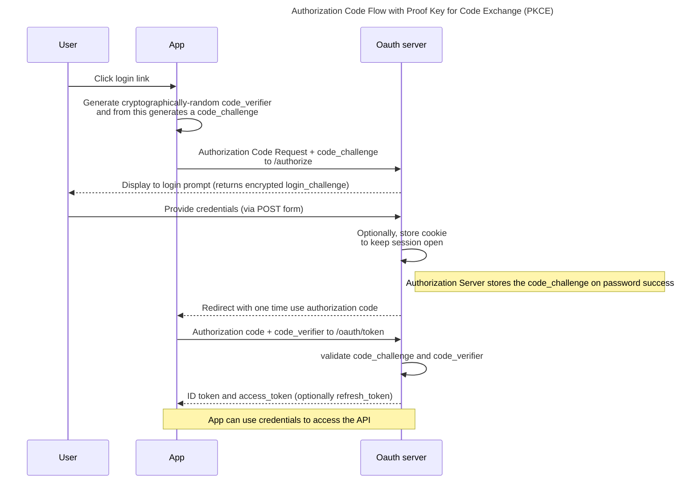

# cake-rest-api-oauth
Basic OAuth based on cake-rest-api

## Authentication flow

```mermaid
sequenceDiagram
    title Authorization Code Flow with Proof Key for Code Exchange (PKCE)
    User->>App: Click login link
    App->>App: Generate cryptographically-random code_verifier<br> and from this generates a code_challenge
    participant Oauth as Oauth server
    App->>Oauth: Authorization Code Request + code_challenge <br> to /authorize
    Oauth-->>User: Display to login prompt (returns encrypted login_challenge)
    User->>Oauth: Provide credentials (via POST form)
    Oauth->>Oauth: Optionally, store cookie <br> to keep session open
    Note right of Oauth: Authorization Server stores the code_challenge on password success
    Oauth-->>App: Redirect with one time use authorization code
    App->>Oauth: Authorization code + code_verifier to /oauth/token
    Oauth->>Oauth: validate code_challenge and code_verifier
    Oauth-->>App: ID token and access_token (optionally refresh_token)
    Note over App,Oauth: App can use credentials to access the API
```

(To see this diagram you need to
install [Mermaid](https://plugins.jetbrains.com/plugin/20146-mermaid)):
